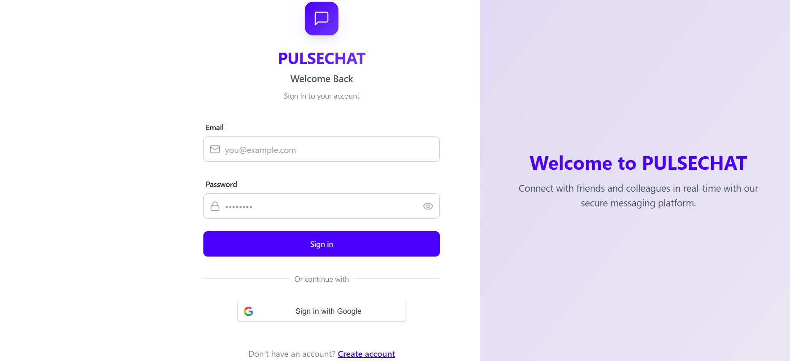

<div align="center">
  
  
  # 🚀 PULSECHAT - Real-time Chat Application
  
  A full-stack real-time chat application built with the MERN stack (MongoDB, Express.js, React, Node.js) and Socket.IO for real-time communication.
  
  [](https://pulse-chat-henna.vercel.app/)
  [](https://pulsechat-kqoq.onrender.com)
  
  
  
  
  
</div>

## 🌟 Features

- **Real-time Messaging**: Instant message delivery with Socket.IO
- **User Authentication**: Secure login/signup with JWT
- **Responsive Design**: Works on desktop and mobile devices
- **Dark/Light Mode**: Toggle between themes
- **File Sharing**: Share images and files
- **Online Status**: See when users are online/offline

## 🚀 Live Demo

Check out the live demo:
- [Frontend](https://your-frontend-url.vercel.app)
- [Backend API](https://pulsechat-kqoq.onrender.com)

## 🛠️ Tech Stack

- **Frontend**: React, Vite, TailwindCSS, DaisyUI, Socket.IO Client
- **Backend**: Node.js, Express, Socket.IO, MongoDB, JWT
- **Deployment**: Vercel (Frontend), Render (Backend), MongoDB Atlas (Database)

## 📸 Screenshots

| Login Screen | Chat Interface |
|--------------|----------------|
|  |  |

## 🚀 Quick Start

### Prerequisites
- Node.js (v16+)
- npm or yarn
- MongoDB Atlas account

### Local Development

1. **Clone the repository**
   ```bash
   git clone https://github.com/AdityaShukla2315/PulseChat.git
   cd PulseChat
   ```

2. **Backend Setup**
   ```bash
   cd backend
   npm install
   cp .env.example .env
   # Update .env with your credentials
   npm run dev
   ```

3. **Frontend Setup**
   ```bash
   cd ../frontend
   npm install
   cp .env.example .env
   # Update .env with your backend URL
   npm run dev
   ```

4. Open [http://localhost:5173](http://localhost:5173) to view it in your browser.

## 🔧 Environment Variables

### Backend (`.env`)
```env
PORT=5001
MONGODB_URI=your_mongodb_uri
JWT_SECRET=your_jwt_secret
CLOUDINARY_CLOUD_NAME=your_cloudinary_name
CLOUDINARY_API_KEY=your_cloudinary_key
CLOUDINARY_API_SECRET=your_cloudinary_secret
NODE_ENV=development
```

### Frontend (`.env`)
```env
VITE_API_URL=http://localhost:5001/api
```

## 🤝 Contributing

Contributions are welcome! Please feel free to submit a Pull Request.

## 📝 License

This project is licensed under the MIT License - see the [LICENSE](LICENSE) file for details.

## 🙏 Acknowledgments

- [Vite](https://vitejs.dev/)
- [React](https://reactjs.org/)
- [Socket.IO](https://socket.io/)
- [DaisyUI](https://daisyui.com/)

---

## 🏗️ Architecture & Tech Stack

- **Frontend:** React 18, Vite, Zustand (state management), React Router, TailwindCSS, DaisyUI, Socket.io-client
- **Backend:** Node.js, Express, MongoDB (Mongoose), JWT Auth, Socket.io, Cloudinary (media uploads)
- **Authentication:** Secure JWT-based system with HTTP-only cookies
- **Real-time:** Socket.io for instant messaging and online status
- **Deployment-ready:** Environment-based configuration, modular codebase, and scalable patterns

---

## ✨ Features

- **User Registration & Login** with hashed passwords and JWT
- **Real-time Chat** (one-to-one) with instant delivery and read receipts
- **Online Status** indicators for users
- **Media Uploads** via Cloudinary (profile pictures, images)
- **Responsive UI** with TailwindCSS & DaisyUI
- **Global State** using Zustand for seamless UX
- **Robust Error Handling** on both client and server
- **Production Deployment**-ready (see below)

---

## ⚡ Quickstart

### 1. Clone & Install

```sh
git clone https://github.com/yourusername/pulsechat.git
cd PULSECHAT
npm install --prefix backend
npm install --prefix frontend
```

### 2. Configure Environment

Create a `.env` file in `/backend` with the following variables:

```env
MONGODB_URI=your_mongodb_connection_string
PORT=5001
JWT_SECRET=your_jwt_secret_key
CLOUDINARY_CLOUD_NAME=your_cloudinary_cloud_name
CLOUDINARY_API_KEY=your_cloudinary_api_key
CLOUDINARY_API_SECRET=your_cloudinary_api_secret
NODE_ENV=development
```

> ℹ️ Make sure to set up a MongoDB database and Cloudinary account for media uploads.

### 3. Run the App

**Backend:**
```sh
cd backend
npm run start
```

**Frontend:**
```sh
cd frontend
npm run dev
```

- Frontend: [http://localhost:5173](http://localhost:5173)
- Backend API: `http://localhost:5001`
- Socket.IO: Connects automatically to the backend

---

## 🧩 Folder Structure

```
PULSECHAT/
├── backend/               # Express API server
│   ├── src/
│   │   ├── config/       # Configuration files
│   │   ├── controllers/  # Route controllers
│   │   ├── lib/          # Utility functions
│   │   ├── middleware/   # Express middleware
│   │   ├── models/       # MongoDB schemas
│   │   ├── routes/       # API routes
│   │   └── index.js      # Entry point
│   └── .env              # Environment variables
│
├── frontend/              # React application
│   ├── public/           # Static files
│   ├── src/
│   │   ├── assets/       # Images, fonts, etc.
│   │   ├── components/   # Reusable UI components
│   │   ├── contexts/     # React contexts
│   │   ├── lib/          # Utility functions
│   │   ├── pages/        # Page components
│   │   ├── store/        # Zustand stores
│   │   └── App.jsx       # Main app component
│   └── .env              # Frontend environment variables
│
├── .gitignore
└── README.md
```

---

## 🛡️ Security & Best Practices

- **Authentication**: JWT-based authentication with HTTP-only cookies
- **Password Security**: bcryptjs for password hashing
- **CORS**: Properly configured for frontend-backend communication
- **Environment Variables**: Sensitive configuration stored in `.env` files
- **Code Organization**: Modular structure with separate concerns
- **Error Handling**: Comprehensive error handling on both client and server

---

## 🚀 Deployment
- Prepare production environment variables
- Build frontend: `npm run build` in `/frontend`
- Use services like Vercel, Netlify (frontend), and Render, Railway, or Heroku (backend)

---

## 🙌 Credits & Resources
- Inspired by the [YouTube video tutorial](https://youtu.be/ntKkVrQqBYY)
- UI: [DaisyUI](https://daisyui.com/), [TailwindCSS](https://tailwindcss.com/)
- Real-time: [Socket.io](https://socket.io/)
- Auth: [JWT](https://jwt.io/)

---

## 💡 Contributing
Pull requests and suggestions are welcome! For major changes, please open an issue first.

---

